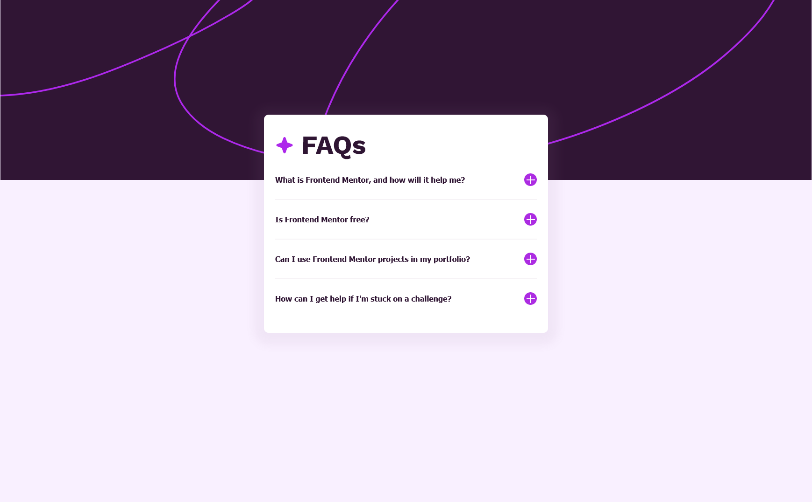

# Frontend Mentor - FAQ accordion solution

This is a solution to the [FAQ accordion challenge on Frontend Mentor](https://www.frontendmentor.io/challenges/faq-accordion-wyfFdeBwBz). Frontend Mentor challenges help you improve your coding skills by building realistic projects. 

## Table of contents

- [Overview](#overview)
  - [The challenge](#the-challenge)
  - [Screenshot](#screenshot)
  - [Links](#links)
- [My process](#my-process)
  - [Built with](#built-with)
  - [Continued development](#continued-development)
- [Author](#author)
- [Acknowledgments](#acknowledgments)

## Overview

### The challenge

Users should be able to:

- Hide/Show the answer to a question when the question is clicked
- Navigate the questions and hide/show answers using keyboard navigation alone
- View the optimal layout for the interface depending on their device's screen size
- See hover and focus states for all interactive elements on the page

### Screenshot

### Links

- Solution URL: [Frontend Mentor](https://www.frontendmentor.io/solutions/responsive-faq-accordion-using-html-css-and-javascript-nIBtuvKeOs)
- Live Site URL: [Github Pages](https://azpenmeadows.github.io/fm-faq-accordion/)

## My process

### Built with

- Semantic HTML5 markup
- CSS custom properties
- Flexbox
- Vanilla JS

### Continued development

I would like to learn how to make accordian tabs close when another one is opened, but for now I think my time would be bette served learning more about Javascript in general rather than going down a rabit hole of uing methods I do not yet understand

## Author

- GitHub - [AzpenMeadows](https://www.your-site.com)
- Frontend Mentor - [@AzpenMeadows](https://www.frontendmentor.io/profile/AzpenMeadows)
